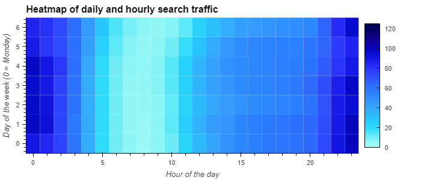
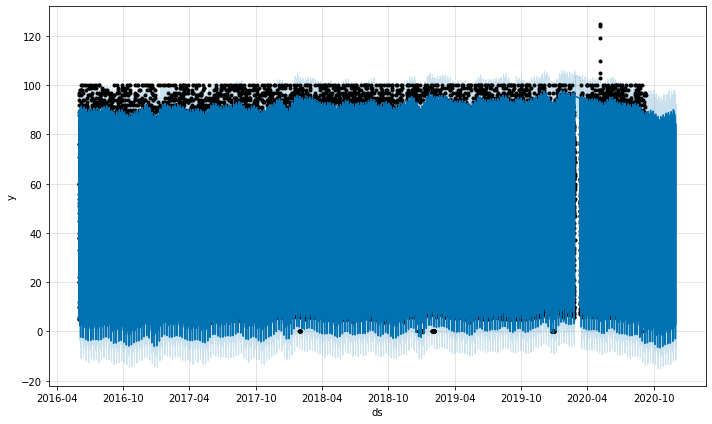

# mercado_time_series_analysis
Utilizing time series analysis and Facebook Prophet to assess how Google search traffic may translate into stock performance for MercadoLibre  

## Technologies

In this project we are utilizing Python 3, Jupyter Lab, Pandas, Facebook Prophet, Google Colab and hvplot.   

Pandas library -- Incredibly useful Python library for data science and data analysis  
Jupyter Lab -- Robust environment to be able to view and edit devopment projects in a streamlined system.   
Google Colab -- virtual cloud Jupyter Lab environment that makes sharing and creating Jupyter notebooks accessible through the Google Cloud.  
hvPlot -- A high-level plotting API for the PyData ecosystem built on HoloViews.  
Facebook Prophet -- a high level time series analysis and projection tool from Facebook.  More information on this open source project, including installation instructions [here.](https://facebook.github.io/prophet/)

---

## Installation Guide (on local machine)

* Pandas -- The source code is currently hosted on GitHub at: https://github.com/pandas-dev/pandas

Binary installers for the latest released version are available at the Python Package Index (PyPI) and on Conda.

### conda
`conda install pandas`
### or PyPI
`pip install pandas`

* Jupyter Lab -- 
    [Link for detailed instructions on installing Jupyter Lab here.](https://jupyter.org/install)  
    
*  The PyViz Ecosystem (visualization package that includes hvPlot)  

### conda
`conda install -c pyviz hvplot`
### or PyPI
`pip install pyviz`  

**For more detailed information on pyviz installation and other features, please reference the [pyviz website](https://pyviz.org/)

## For working within Google Colab, visit the site [here](https://colab.research.google.com/), then dependencies and files can be loaded from within Google Colab  
 
---
## Dependencies (notice different syntax when importing in Google Colab):  

```python 
from IPython.display import clear_output
try:
  !pip install pystan
  !pip install fbprophet
  !pip install hvplot
  !pip install holoviews
except:
  print("Error installing libraries")
finally:
  clear_output()
  print('Libraries successfully installed')
  ```  

**Please note that while dependencies, files and other functionality can be facilitated outside of Google Colab, for this project Colab is recommended due to constraints around using Facebook Prophet within Jupyter Notebook in some instances.
## Usage

### We initially read in a .csv file with historical Google Search Trends data for MercadoLibre in order to look for seasonal trends  

**Isolating the Search trends for May of 2020 --  
```python  
# Calculate the sum of the total search traffic for May 2020
traffic_may_2020 = df_may_2020['Search Trends'].sum()
```  
**Calculate median search traffic per month within our dataset by grouping by year and then month --

```python  
# Calcluate the monhtly median search traffic across all months 
# Group the DataFrame by index year and then index month, chain the sum and then the median functions
group_elements = [df_mercado_trends.index.year, df_mercado_trends.index.month]

median_monthly_traffic = df_mercado_trends.groupby(by=group_elements).sum().median()
```   

**By comparing the search traffic between May of 2020 vs. the median traffic by month for the rest of our dataset, we notice a much higher number for May of 2020, indicating a possible post-Covid / shutdown spike in search traffic.  

### By utilizing an hvplot heatmap, we can visualize search traffic by day of the week and hour of the day to see if we can identify any valuable trends in our dataset --  

```python  
# Holoviews extension to render hvPlots in Colab
hv.extension('bokeh')

# Use hvPlot to visualize the hour of the day and day of week search traffic as a heatmap.
df_mercado_trends.hvplot.heatmap(y = 'Date.dayofweek', x='Date.hour', ylabel = 'Day of the week (0 = Monday)', xlabel = 'Hour of the day', C='Search Trends', title = 'Heatmap of daily and hourly search traffic')  
```
  

###  By utilizing Facebook Prophet, we can analyze our historical search trend data and project out to see what trends we might see in the coming periods --  

  

**We can see above where our actual data points (black dots) end but the Prophet projections keep going out to our specified time of 2000 periods or hours based on our dataset  

###  Lastly we utilize Prophet with our daily revenue .csv file to generate revenue projections for the upcoming quarter for MercadoLibre.  By utilizing the models component analysis, we can isolate the yhat_lower ('lowest'), yhat_upper('highest'), and yhat ('most likely') variables in our projection dataframe to be able to project out the revenue numbers.  

```python  
# Displayed the summed values for all the rows in the forecast_quarter DataFrame
display(mercado_sales_forecast_quarter.sum())  

Best Case      2117.456877
Worst Case     1773.794815
Most Likely    1945.376201
dtype: float64
```


## License

Licensed under the [MIT License](https://github.com/git/git-scm.com/blob/main/MIT-LICENSE.txt)  Copyright 2021 Dave Thomas.


